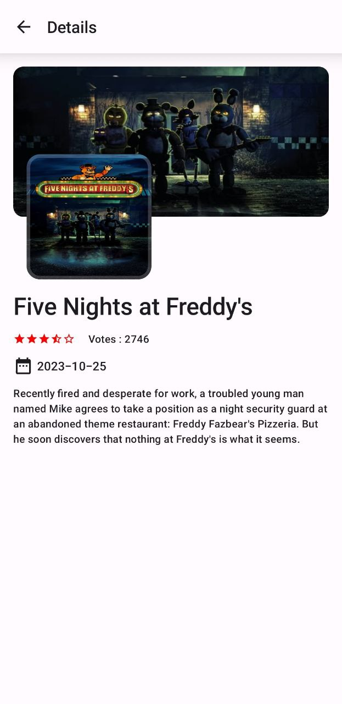

# Yassir Movie DB

In the Yassir Movie DB project, I employed Clean Architecture along with MVVM. The user interface is developed using Jetpack Compose, and the main language used is Kotlin. Additionally, Dagger Hilt is utilized for dependency injection, Retrofit for network requests, and Coil for efficient image loading.

## Table of Contents

- [Android Studio 2023.1.1(HedgHog)]
- Kotlin version : 1.9.0
- Dagger Hilt 2.48
- Jetpack Compose 1.5.1
- Retrofit 2.9.0

### Clean Architecture: (*)

  * Purpose: Separation of concerns, maintainability.
  * Key Concepts: Layers (presentation, domain, data). (I didnt add domain layer here cuz it simple project )
    
### MVVM (Model-View-ViewModel): (*)

  * Purpose: Efficiently manage UI-related logic and data presentation.
  * Key Components: Model (data), View (UI), ViewModel (manages UI-related logic).

### Dagger Hilt: (*)

  * Purpose: Dependency injection framework for Android applications.
  * Key Features: Simplifies DI setup, supports compile-time verification, and minimizes boilerplate code.
    
## Screenshots

  
  
  
  

